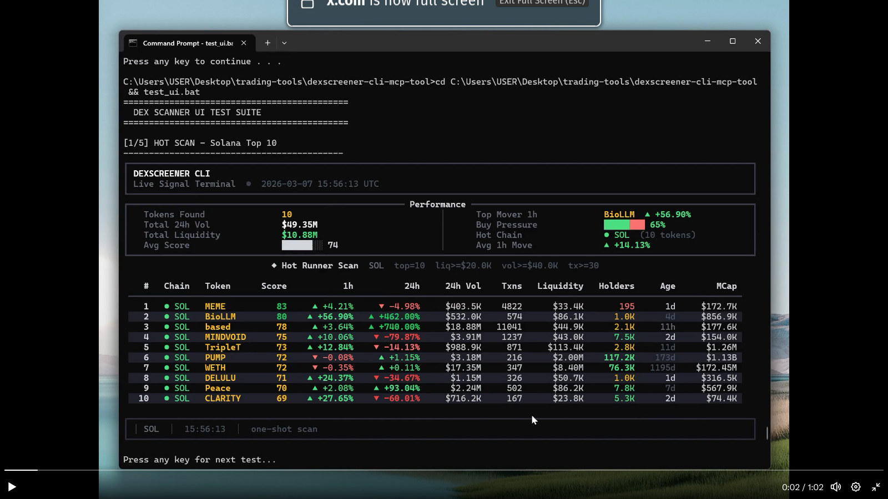

# Solana Trading Bot

[](https://www.typescriptScriptlang.org/)
[](https://nodejs.org/)
[](https://vitest.dev/)
[](LICENSE)

A production-ready automated trading bot for Solana DEXs with real-time token discovery, multi-layer safety validation, and Jupiter swap integration.



---

## Features

### Real-Time Token Discovery
- DexScreener WebSocket integration for instant token detection
- Age-based classification (FRESH vs WARM tokens)
- Automatic filtering via Jupiter tradeability checks

### Multi-Layer Safety Validation
- **RugCheck.xyz** - Mint authority, freeze authority, liquidity analysis
- **GoPlus Security** - Smart contract verification, honeypot detection
- **Jupiter Pre-filter** - Only tradeable tokens considered

### Jupiter DEX Integration
- Real-time quote fetching with slippage estimation
- Atomic swap execution via Jupiter Ultra API
- Priority fee optimization for fast landing

### Paper Trading Mode
- Real Jupiter quotes, simulated execution
- Performance tracking before live deployment
- Realistic slippage and fee modeling

### Position Management
- SQLite-based position tracking
- Automated stop-loss and take-profit
- Configurable exit strategies

---

## Tech Stack

| Layer | Technology |
|-------|------------|
| Language | TypeScript 5.0+ |
| Runtime | Node.js 20+ |
| Blockchain | @solana/web3.js |
| DEX Aggregation | Jupiter Ultra API |
| Database | Better SQLite3 |
| Real-time Data | DexScreener WebSocket |
| RPC Provider | Helius |
| Testing | Vitest |

---

## Quick Start

```bash
# Install dependencies
npm install

# Configure environment
cp .env.example .env
# Edit .env with your API keys

# Run tests
npm test

# Start in paper trading mode
npm run start:paper

# Start in live mode (use with caution)
npm run start:live
```

---

## Architecture

```
┌─────────────────────────────────────────────────────────────┐
│                    DISCOVERY LAYER                          │
│   DexScreener WebSocket → Age Classification → Jupiter      │
└─────────────────────────────────────────────────────────────┘
                              │
                              ▼
┌─────────────────────────────────────────────────────────────┐
│                    SAFETY LAYER                             │
│   RugCheck.xyz + GoPlus Security + Liquidity Analysis       │
└─────────────────────────────────────────────────────────────┘
                              │
                              ▼
┌─────────────────────────────────────────────────────────────┐
│                    TRADING LAYER                            │
│   Jupiter Quotes → Slippage Estimation → Atomic Swaps       │
└─────────────────────────────────────────────────────────────┘
                              │
                              ▼
┌─────────────────────────────────────────────────────────────┐
│                    POSITION LAYER                           │
│   SQLite Tracking → Stop Loss → Take Profit → Exit          │
└─────────────────────────────────────────────────────────────┘
```

---

## Configuration

```bash
# Required
HELIUS_RPC_URL=https://mainnet.helius-rpc.com/?api-key=YOUR_KEY
WALLET_PRIVATE_KEY=your_base58_private_key

# Optional (enhanced safety)
GOPLUS_API_KEY=your_api_key

# Trading mode: paper | live
TRADING_MODE=paper
```

---

## Project Structure

```
src/
├── bot/           # Main orchestrator and configuration
├── db/            # SQLite client and migrations
├── entry/         # Entry validation and execution
├── exit/          # Exit strategies and monitoring
├── safety/        # RugCheck, GoPlus integrations
├── scanner/       # DexScreener WebSocket discovery
├── jupiter/       # Jupiter API client
└── utils/         # Decimal handling, retry logic

tests/             # 299 tests across all modules
```

---

## Testing

```bash
# Run all tests
npm test

# Run with coverage
npm run test:coverage

# Run specific test file
npx vitest run tests/safety/rugcheck.test.ts
```

---

## Disclaimer

This software is provided for educational purposes. Cryptocurrency trading involves significant risk. Use at your own risk. The authors are not responsible for any financial losses.

---

## License

MIT

---

*Built with TypeScript + Solana + Jupiter*
